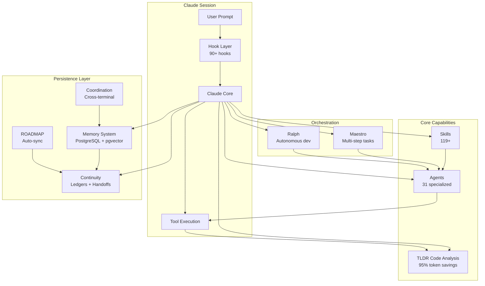

# System Overview

High-level map of all Continuous Claude subsystems and how they connect.

## Subsystem Summary

| Subsystem | Components | Purpose |
|-----------|-----------|---------|
| Hook Layer | 90+ TypeScript hooks | Intercept events, inject context, enforce rules |
| Skills | 119+ workflows | Pre-built task flows triggered by natural language |
| Agents | 31 specialized | Focused AI assistants for delegation |
| TLDR | 5-layer AST analysis | Structural code understanding at 95% token savings |
| Memory | PostgreSQL + BGE embeddings | Persistent learnings across sessions |
| Continuity | Ledgers + handoffs | State transfer between sessions |
| Coordination | Session + file_claims tables | Multi-terminal conflict prevention |
| ROADMAP | 4 auto-sync hooks | Goal tracking and progress visibility |

Last verified: 2026-02-20
