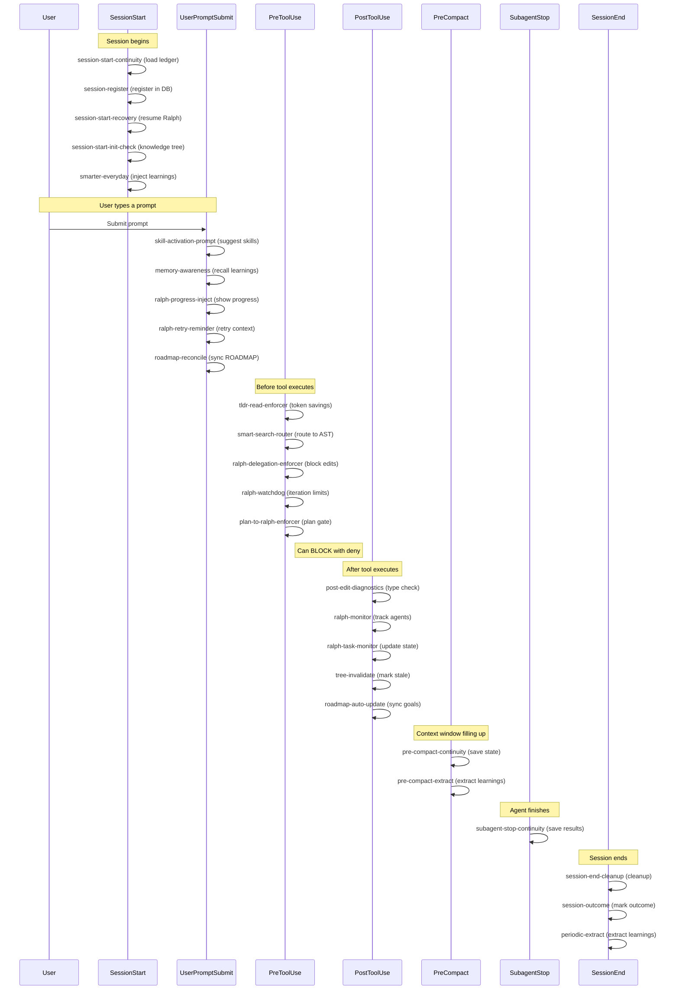

# Hook Lifecycle

Complete hook event flow showing the 7 lifecycle events in temporal order.

## Event Details

| Event | Timing | Can Block? | Key Hooks |
|-------|--------|-----------|-----------|
| **SessionStart** | Session opens | No | Load ledger, register DB, resume Ralph, init knowledge tree |
| **UserPromptSubmit** | Before processing prompt | No (inject only) | Suggest skills, recall memories, inject progress |
| **PreToolUse** | Before any tool call | **Yes (deny)** | Token savings, search routing, delegation enforcement |
| **PostToolUse** | After tool completes | No | Diagnostics, state tracking, tree invalidation |
| **PreCompact** | Context nearing limit | No | Save continuity state, extract learnings |
| **SubagentStop** | Agent task finishes | No | Save agent results to continuity |
| **SessionEnd** | Session closes | No | Cleanup, outcome marking, learning extraction |

## Blocking Hooks (PreToolUse)

These hooks can return `deny` to prevent a tool from executing:

| Hook | Blocks When |
|------|------------|
| ralph-delegation-enforcer | Edit/Write during Ralph mode |
| ralph-watchdog | Iteration limit exceeded |
| plan-to-ralph-enforcer | Code edit after plan approval without Ralph |
| tldr-read-enforcer | File read when TLDR summary available |
| smart-search-router | Grep when AST search is better |

Last verified: 2026-02-20
