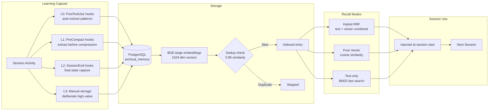

# Memory System

Learning lifecycle from session activity through storage to recall.

## Storage Pipeline

| Layer | Trigger | What Gets Captured |
|-------|---------|-------------------|
| **L0** | PostToolUse hooks | Tool use patterns, codebase observations |
| **L1** | PreCompact hooks | Reasoning from thinking blocks before compression |
| **L2** | SessionEnd hooks | Final session state, outcome, key decisions |
| **L3** | Manual `store_learning.py` | Deliberate high-value insights |

## Learning Types

| Type | Use For |
|------|---------|
| `WORKING_SOLUTION` | Fixes and approaches that worked |
| `ERROR_FIX` | How specific errors were resolved |
| `CODEBASE_PATTERN` | Recurring patterns in code |
| `FAILED_APPROACH` | What didn't work (avoid repeating) |
| `ARCHITECTURAL_DECISION` | Design choices with rationale |
| `USER_PREFERENCE` | User's preferred approaches |

## Search Modes

| Mode | Score Range | Best For |
|------|------------|---------|
| Hybrid RRF (default) | 0.01-0.03 | General queries, best accuracy |
| Pure vector | 0.4-0.6 | Semantic similarity matching |
| Text-only | 0.01-0.05 | Exact keyword matching, fast |

## Database Schema

| Table | Purpose |
|-------|---------|
| `archival_memory` | Learnings with BGE embeddings (1024-dim) |
| `sessions` | Cross-terminal session awareness |
| `file_claims` | Cross-terminal file locking |
| `handoffs` | Session handoffs with embeddings |

Last verified: 2026-02-20
