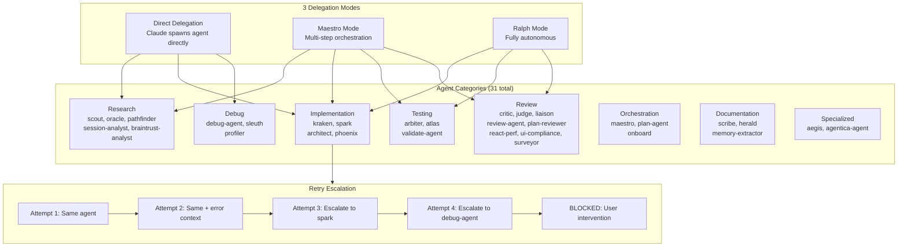

# Agent Orchestration

Delegation patterns, agent categories, and retry escalation.



## Delegation Modes

| Mode | Trigger | Human-in-Loop | Bounded? |
|------|---------|--------------|----------|
| **Direct** | Claude routes task to agent | Per-task approval | No |
| **Maestro** | `/maestro` command | Interview + phase gates | Phase-level |
| **Ralph** | `/ralph` command | Plan approval only | 10/30/50 iterations |

## Agent Selection Guide

| Task | Primary Agent | Fallback |
|------|--------------|----------|
| Codebase exploration | scout | oracle |
| External research | oracle | pathfinder |
| Feature implementation | kraken (complex) | spark (simple) |
| Bug investigation | sleuth | debug-agent |
| Test execution | arbiter (unit) | atlas (E2E) |
| Code review | critic | principal-reviewer |
| Refactoring | phoenix (plan) | kraken (execute) |
| Documentation | scribe | herald (releases) |
| Security audit | aegis | - |

## Iteration Limits (Ralph Mode)

| Task Size | Max Iterations | Escalation At |
|-----------|---------------|--------------|
| Small | 10 | After limit |
| Medium | 30 | After limit |
| Large | 50 | After limit |

## Retry Escalation Chain

```
Attempt 1: Same agent, original instruction
Attempt 2: Same agent, error context added
Attempt 3: spark (quick fix specialist)
Attempt 4: debug-agent (root cause analysis)
Attempt 5: BLOCKED -- requires user intervention
```

Last verified: 2026-02-20
