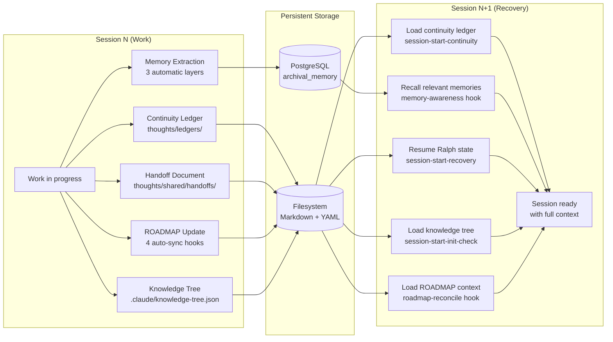

# Continuity Flow

Cross-session state transfer and recovery mechanisms.

## State Artifacts

| Artifact | Location | Created By | Loaded By |
|----------|----------|-----------|-----------|
| Continuity Ledger | `thoughts/ledgers/CONTINUITY_*.md` | Manual or pre-compact hook | session-start-continuity |
| Handoff Document | `thoughts/shared/handoffs/*/current.yaml` | `/create_handoff` skill | `/resume_handoff` skill |
| Memory Learnings | PostgreSQL `archival_memory` table | 3 extraction layers + manual | memory-awareness hook |
| ROADMAP | `ROADMAP.md` | 4 auto-sync hooks | roadmap-reconcile hook |
| Knowledge Tree | `.claude/knowledge-tree.json` | knowledge_tree.py + hooks | session-start-init-check |
| Ralph State | `.ralph/state.json` | Ralph workflow | session-start-recovery |

## ROADMAP Auto-Sync (4 Hooks)

| Hook | Event | Action |
|------|-------|--------|
| roadmap-reconcile | UserPromptSubmit | Inject current ROADMAP context |
| roadmap-auto-update | PostToolUse | Update after plan/commit actions |
| roadmap-plan-sync | PostToolUse | Sync plan decisions to ROADMAP |
| roadmap-commit-sync | PostToolUse | Sync commit outcomes to ROADMAP |

## Handoff Outcomes

Every handoff requires an outcome marker:

| Outcome | Meaning |
|---------|---------|
| `SUCCEEDED` | All goals met |
| `PARTIAL_PLUS` | Most goals met, minor items remain |
| `PARTIAL_MINUS` | Some goals met, significant work remains |
| `FAILED` | Goals not met, blockers documented |

Last verified: 2026-02-20
