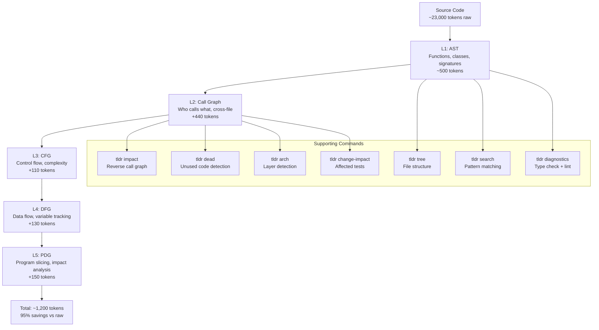

# TLDR Analysis Stack

5-layer code analysis pipeline showing token savings at each level.

## Layer Details

| Layer | Name | Tokens | What It Provides | CLI Command |
|-------|------|--------|-----------------|-------------|
| **L1** | AST | ~500 | Functions, classes, signatures, imports | `tldr structure` |
| **L2** | Call Graph | +440 | Who calls what across files | `tldr calls` |
| **L3** | CFG | +110 | Control flow paths, cyclomatic complexity | `tldr cfg` |
| **L4** | DFG | +130 | Data flow, variable definitions and uses | `tldr dfg` |
| **L5** | PDG | +150 | Program slicing, what affects line N | `tldr slice` |

**Total: ~1,200 tokens vs. 23,000 raw = 95% savings**

## Hook Integration

| Hook | Event | Action |
|------|-------|--------|
| tldr-read-enforcer | PreToolUse (Read) | Returns TLDR summary instead of full file |
| smart-search-router | PreToolUse (Grep) | Routes text search to AST-based search |

## Supporting Analysis Commands

| Command | Purpose | Input |
|---------|---------|-------|
| `tldr tree` | File structure overview | Directory path |
| `tldr search` | Structural pattern search | Regex pattern |
| `tldr impact <func>` | Reverse call graph (who calls this?) | Function name |
| `tldr dead` | Find unreachable/unused functions | Directory path |
| `tldr arch` | Detect architectural layers (entry/middle/leaf) | Directory path |
| `tldr diagnostics` | Run pyright + ruff (type check + lint) | File or directory |
| `tldr change-impact` | Find tests affected by code changes | Changed files |

## Languages Supported

Python, TypeScript, Go, Rust (via tree-sitter parsing)

Last verified: 2026-02-20
